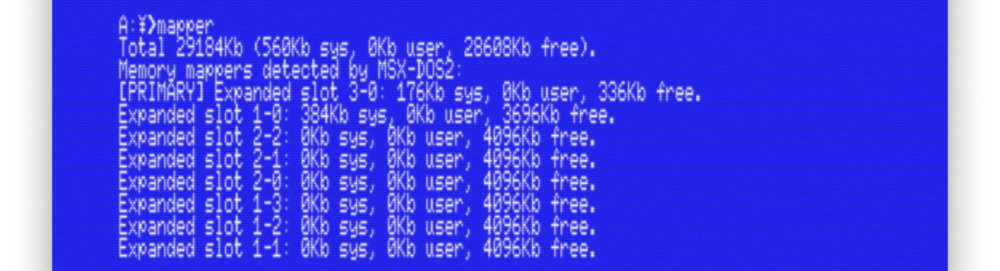

# MAPPER.COM

This is a small tool for MSX computers (or emulators) running MSX-DOS2 or [Nextor](https://github.com/Konamiman/Nextor).

It prints a description of all the memory mappers detected by the operating system, as well as the total amount of RAM.

Source code in Z80 assembler provided.

## Usage

Put the `MAPPER.COM` binary anywhere in the operating system's `PATH` (if running from a hard drive or any other kind of mass storage), or in the current path, and simply run it. It doesn't need or recognize any command line parameters.

The first line in the output will print a summary of the total memory found in the memory mappers. It will describe the total memory reserved by the opereating system, memory currently allocated to user programs, and free memory.

Next there will be one to eight lines describing the same parameters memory reserved by the operating system, memory allocated to user programs, and free memory) for each of the memory mappers detected by the operating system, along with the slot address of each mapper. The primary memory mapper will be highlighted with a `[PRIMARY]` string before its slot address.

### Examples

*Note: all these examples are run under the [openMSX](https://openmsx.org) emulator.*

Running the `MAPPER.COM` command in a plain MSX2 computer (Philips NMS 8250) with a single 128KB memory mapper:

Running the `MAPPER.COM` command in an MSX turbo-R computer (Panasonic FS-A1GT) with two slot expanders and seven 4MB memory expansions:

## Build

This program is distributed in source code form, but the assembler (`AS.COM`) and linker (`LD.COM`) required to build it are included in the repository.

Both of these tools were developed by Egor Voznessenski. Sadly, he passed away a few years ago.

To build the binary, run the `MAKE.BAT` script. This will first assemble the `MAPPER.AS` program into a relocatable file, then it will do the same with the `BIN2STR.AS` program, which is just a library containing a series of routines to convert binary values into (hexa)decimal strings. Finally it will link the relocatable files into the `MAPPER.COM` binary and clean up temporary files left behind by the assembler and linker.

## License

Copyright 2022 Javier Lavandeira.

Released under the [GPLv3](https://www.gnu.org/licenses/gpl-3.0.en.html) license. The source code is heavily commented in the hope that it will help others understand how memory works in MSX computers and to encourage the development of new tools and applications.